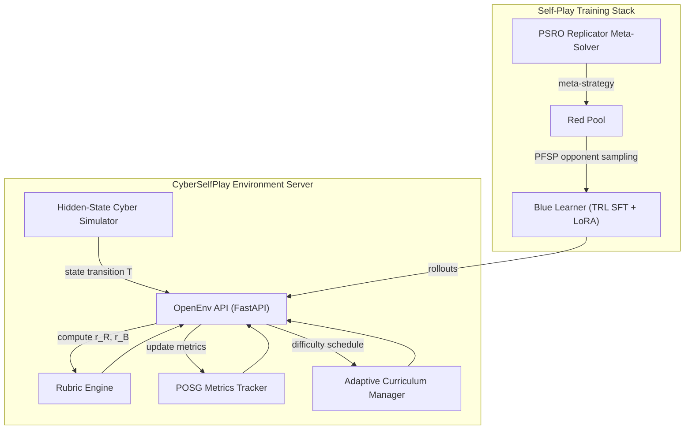
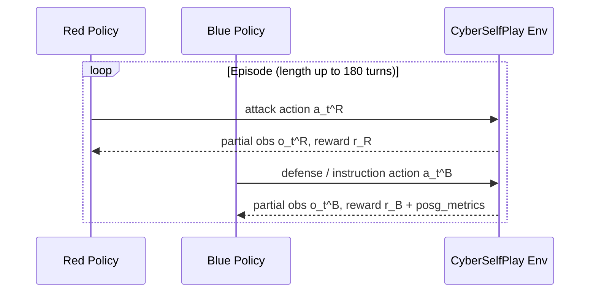

# CyberSelfPlay: Autonomous Red-vs-Blue Cyber Defense Environment

**CyberSelfPlay** is an OpenEnv-compliant reinforcement learning world built for
**long-horizon planning + instruction following (Theme 2)** and
**self-improvement + co-evolution (Theme 4)**.
A Blue policy can execute long enterprise recovery plans (up to 300
instructions) under partial observability, with a **stochastic** cyber simulator
and **rich Red vs Blue** action spaces (see [two training tracks](#8-hackathon-theme-alignment) below).

| Track | What it is |
| --- | --- |
| **[SFT + GRPO](train/README-GRPO.md)** (e.g. `train/kaggle_grpo.py`, `train/grpo_space.py`) | Supervised warm-start, then **on-policy** refinement: the **Blue** LLM **improves from its own rollouts** scored by the environment. Documented, GPU-friendly, **primary path** for reproducing the fine-tuned Blue policy. |
| **League + PFSP + PSRO** | Optional **population**-based training: opponent pools, `f(w)=w(1-w)` weighting, replicator-style meta-updates. See `run_demo.py`, `train/colab_trl_selfplay.py`, `train/pfsp.py`, `train/psro_meta.py`. |

---

## 1. Core Reasoning Technologies

### 1.1 Two-Player POSG Cyber Model
Formalized as a partially observable stochastic game:

$$
\mathcal{G}=\langle \mathcal{S},\mathcal{A}_R,\mathcal{A}_B,\mathcal{O}_R,\mathcal{O}_B,T,Z_R,Z_B,r_R,r_B,\gamma \rangle
$$

with player objectives

$$
J_i(\pi_i,\pi_{-i})=\mathbb{E}\left[\sum_{t=0}^{H}\gamma^t r_i(s_t,a_t^R,a_t^B)\right], \quad i\in\{R,B\}
$$

and a near-zero-sum coupling with collateral disruption:

$$
r_B=-r_R-\lambda C_{\mathrm{collateral}}.
$$

### 1.2 Long-Horizon Instruction Execution
Blue must satisfy a mission list $\mathcal{I}=\{I_1,\dots,I_N\}$ with $N\in\{40,120,300\}$
across `small / medium / large` scenarios. Completion / violation rates:

$$
\rho_{\mathrm{inst}}=\frac{|\mathcal{I}_{\mathrm{done}}|}{|\mathcal{I}|},\qquad
\nu_{\mathrm{inst}}=\frac{|\mathcal{I}_{\mathrm{violated}}|}{|\mathcal{I}|}.
$$

These values are surfaced in `observation.metadata["posg_metrics"]` every step.

### 1.3 Dense + Delayed Reward Law
Red:

$$
\begin{aligned}
r_R &= w_1 \mathbb{1}_{\mathrm{foothold}} + w_2 \mathbb{1}_{\mathrm{priv}} + w_3 \mathbb{1}_{\mathrm{lateral}} + w_4 \mathbb{1}_{\mathrm{exfil}} \\
&\quad - w_5 \mathbb{1}_{\mathrm{detect}} + w_6 \mathbb{1}_{\mathrm{plan\_sabotage}} - \eta_R.
\end{aligned}
$$

Blue:

$$
\begin{aligned}
r_B &= v_1 \mathbb{1}_{\mathrm{detect}} + v_2 \mathbb{1}_{\mathrm{contain}} + v_3 \mathbb{1}_{\mathrm{recover}} - v_4 \mathbb{1}_{\mathrm{exfil}} \\
&\quad + v_5 \mathbb{1}_{\mathrm{instr\_progress}} + v_6 \mathbb{1}_{\mathrm{checkpoint}} - v_7 \mathbb{1}_{\mathrm{instr\_violation}} \\
&\quad + v_8 \rho_{\mathrm{inst}} - \eta_B.
\end{aligned}
$$

### 1.4 Adaptive Self-Improvement via League
Opponents are drawn from each side's pool with **PFSP** weighting:

$$
p_j \propto f(w_j),\qquad f(w)=w(1-w),
$$

prioritizing matchups near $w_j=0.5$. A PSRO-style **replicator** step refines
the meta-strategy:

$$
p_i' \propto p_i\left(1+\eta(u_i-\bar{u})\right),\qquad \bar{u}=\sum_i p_i u_i.
$$

---

## 2. Architecture





---

## 3. Long-Horizon Dynamics

| scenario | turns | instructions | checkpoint stride |
|---------:|------:|-------------:|------------------:|
| small    |    60 |           40 |                 8 |
| medium   |   100 |          120 |                12 |
| large    |   180 |          300 |                20 |

Blue receives delayed checkpoint rewards every `checkpoint_every` steps and only
wins by timeout if $\rho_{\mathrm{inst}}\ge 0.6$.

---

## 4. Built-in Evaluation Metrics

$$
\mathrm{MTTD}=t_{\mathrm{first\_detect}}-t_{\mathrm{first\_compromise}},\qquad
\mathrm{MTTR}=t_{\mathrm{recover}}-t_{\mathrm{first\_detect}}.
$$

Plus: exfiltration success rate, critical asset compromise rate, false-positive
disruption cost, instruction completion / violation rates, and the league
exploitability-gap proxy.

---

## 5. Project Layout

```
cyber_selfplay/
├── cyber_selfplay_env/           # OpenEnv environment package
│   ├── environment.py            # Env class (graceful error obs, no crashes)
│   ├── simulator.py              # Hidden-state cyber range + missions
│   ├── rubrics.py                # r_R / r_B reward composition
│   ├── metrics.py                # MTTD / MTTR / mission rates
│   ├── curriculum.py             # Auto-escalating scenario manager
│   ├── tools_red.py / tools_blue.py
│   ├── scenarios.py              # small / medium / large presets
│   └── models.py                 # CyberAction / CyberObservation pydantic
├── server/
│   └── app.py                    # FastAPI app (+ /artifacts, /info, /health)
├── train/
│   ├── _bootstrap.py             # sys.path bootstrap shared by all scripts
│   ├── README-GRPO.md            # SFT+GRPO pipeline (Kaggle/Space) + theme alignment
│   ├── kaggle_grpo.py            # one-cell SFT+GRPO (Kaggle; primary tuned path)
│   ├── kaggle_grpo_league.py     # SFT + PFSP/PSRO league + GRPO per round (Kaggle)
│   ├── grpo_space.py             # same pipeline for HF Space / Docker
│   ├── pfsp.py                   # PFSP opponent sampling
│   ├── psro_meta.py              # Replicator meta-solver
│   ├── colab_trl_selfplay.py     # Single-policy TRL SFT loop (default)
│   ├── train_blue_vs_pool.py     # Blue learner vs PFSP Red pool
│   ├── train_red_vs_pool.py      # Red-side data collection vs Blue pool
│   └── evaluate_league.py        # Real rollouts + exploitability proxy
├── tests/                        # pytest smoke tests (no torch needed)
├── notebooks/colab_trl_selfplay.ipynb
├── client.py                     # OpenEnv client (mirrors AutoMathReasoner)
├── Dockerfile / .dockerignore    # HF Spaces (Docker SDK) ready
├── pyproject.toml                # [train] + [dev] extras
├── requirements.txt              # plain-pip server install
├── requirements-train.txt        # plain-pip training stack
├── Makefile                      # shortcuts: serve / train / test / docker
└── openenv.yaml                  # OpenEnv manifest
```

---

## 6. Quickstart

### 6.0 ⭐ Judge / reviewer entry points

**A — Full stack demo (environment + league + PFSP + PSRO in one run):**
```bash
pip install -e .[train]      # one-time install
python run_demo.py           # end-to-end: env + PFSP + PSRO + rollouts + league + TRL SFT + artifacts
# fastest path (no fine-tune, ~20s):
python run_demo.py --no-train --no-upload --episodes 6 --max-steps 30 --grid-episodes 1
```
`run_demo.py` runs multiple stages, prints a summary JSON, and writes outputs under
`artifacts/` and `outputs/`.

**B — SFT + GRPO Blue policy (matches Kaggle / HF Space training):** see
**[train/README-GRPO.md](train/README-GRPO.md)** — one notebook cell (`kaggle_grpo.py`)
or `grpo_space.py` in Docker, with training curves, logs, and LoRA export.

### 6.1 Install + run server locally
```bash
pip install -e .                 # server only
pip install -e .[train]          # adds TRL stack for training
python -m server.app --port 7870
```
Endpoints: `/health`, `/info`, `/artifacts`, plus the standard OpenEnv routes.

### 6.2 Run smoke tests
```bash
pip install -e .[dev]
pytest -q
```

### 6.3 SFT + GRPO (recommended for a measured RL fine-tune)
See **[train/README-GRPO.md](train/README-GRPO.md)**. Entry points: `train/kaggle_grpo.py` (Kaggle), `train/grpo_space.py` (Hugging Face Space / Docker with env vars).

### 6.4 Single-policy TRL SFT (`colab_trl_selfplay.py`)
```bash
python train/colab_trl_selfplay.py
# outputs/cyber-blue-sft/   <- LoRA model
# artifacts/                <- logs, CSV, plots, JSON summaries
```

### 6.5 League self-play (PFSP alternating)
```bash
TRAIN_LEAGUE_ROUNDS=2 python train/colab_trl_selfplay.py
# or the dedicated entry points:
python train/train_blue_vs_pool.py --rounds 2 --episodes 8
python train/train_red_vs_pool.py  --rounds 2 --episodes 6
python train/evaluate_league.py    --episodes 3
```

### 6.6 Optional Hugging Face Hub upload
```bash
export HF_TOKEN=hf_xxx
export HF_MODEL_REPO=yourname/cyber-blue-sft
python train/colab_trl_selfplay.py
```

### 6.7 Docker
```bash
make docker-build
make docker-run                 # http://localhost:7870
```

---

## 7. Hugging Face Spaces Deployment

This repo is HF-Spaces-ready (Docker SDK; metadata at the top of this README).

1. Create a new Space (Docker SDK), push this folder.
2. Open **Settings → Variables and secrets** and set:

| Variable                | Default | Purpose                                             |
| ----------------------- | ------- | --------------------------------------------------- |
| `RUN_TRAIN_ON_STARTUP`  | `0`     | Set to `1` to launch training when the Space boots. |
| `TRAIN_ONCE_TAG`        | empty   | E.g. `v1` — only train once per tag value.          |
| `TRAIN_LEAGUE_ROUNDS`   | `0`     | `>0` switches to PFSP league self-play.             |
| `TRAIN_SCRIPT_PATH`     | `train/colab_trl_selfplay.py` | Override training entry point.   |
| `HF_TOKEN`              | secret  | Required only if uploading the trained model.       |
| `HF_MODEL_REPO`         | empty   | E.g. `youruser/cyber-blue-sft` for upload target.   |

3. After a training run, fetch artifacts:
```bash
curl https://<your-space-url>/artifacts
```
Files appear in `artifacts/` (logs, CSV, plots) and `outputs/` (model dir).

> Defaults are **safe**: training never auto-runs unless you explicitly set
> `RUN_TRAIN_ON_STARTUP=1`. The `/health` and `/artifacts` endpoints work
> without any training.

---

## 8. Hackathon Theme Alignment

- **Theme 2 — Long-horizon reasoning & instruction following:** up to 300
  ordered instructions, partial observability, sparse + dense + delayed checkpoint
  rewards, instruction progress / violation signals in `blue_reward`, and
  structured `CyberAction` output — trained policies map observations to
  env-scored actions (SFT+GRPO and league tracks both use this environment).

- **Theme 4 — Self-improvement / co-evolution (two ways in this repo):**
  1. **SFT + GRPO** — the Blue policy **improves after deployment** of the SFT
     checkpoint: it samples its own completions, receives environment rewards, and
     updates with **group-relative** RL. That is **on-policy self-improvement** in
     a **stochastic** simulator. Details: [train/README-GRPO.md](train/README-GRPO.md).
  2. **League + PFSP + PSRO** — **population**-based co-evolution: opponent pools,
     PFSP weighting, PSRO-style replicator updates, and league evaluation
     (`run_demo.py`, `train/pfsp.py`, `train/psro_meta.py`, `train/evaluate_league.py`).
     Optional add-on or second stage if you want explicit multi-opponent training.

---

## 9. References

- Vinyals et al., *Nature* 2019 — AlphaStar / league training.
- Lanctot et al., *NeurIPS* 2017 — PSRO.
- Hu et al., *ACM TOPS* 2021 — Cyber Defense POMDP.
- TTCP CAGE-2 — Defender POMDP formulation.
