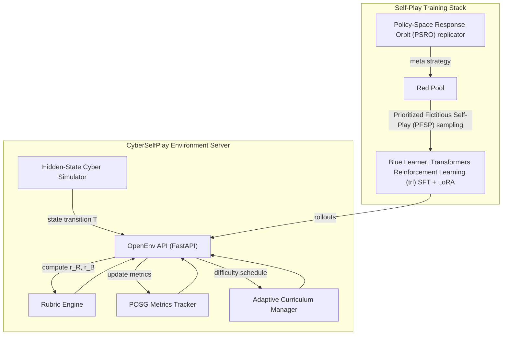
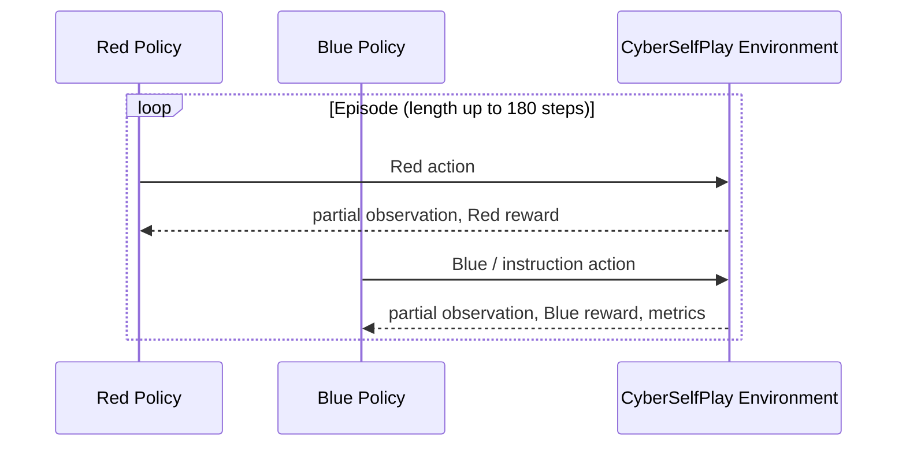

# CyberSelfPlay: Autonomous Red Team versus Blue Team Cyber Defense Environment

**CyberSelfPlay** is a reinforcement learning world that follows the **OpenEnv** protocol (**Open Environment** for agent–environment interaction). It supports **long-horizon planning and instruction following** (competition *Theme 2*) and **self-improvement and co-evolution** (competition *Theme 4*). A **Blue** defender policy can run long recovery plans (up to 300 **instructions**), under **partial observability**, using a **stochastic** cyber **simulator** and rich **Red** (attacker) versus **Blue** (defender) action spaces. Documented **training** uses the **Hugging Face** package **`trl`** (**Transformers Reinforcement Learning**, **TRL**) and **Kaggle** or **Google Colab** notebooks with a **Graphics Processing Unit (GPU)** (see [Training scripts](#training-scripts-kaggle-and-google-colab), [Kaggle](#how-to-run-on-kaggle-both-scripts), and [Colab](#how-to-run-on-google-colab-both-scripts)). For what to **attach** when you **report** results, see [Results and documentation attachments (by training approach)](#results-and-documentation-attachments-by-training-approach). For competition alignment, see [Hackathon theme alignment](#6-hackathon-theme-alignment).

---

## Abbreviations and full forms

| Short form | Full name or meaning |
| --- | --- |
| **SFT** | **Supervised Fine-Tuning** — imitation of a reference policy on fixed data. |
| **GRPO** | **Group Relative Policy Optimization** — on-policy **reinforcement learning** with a group of sampled completions and **group-relative** advantages (see **Hugging Face** `GRPOTrainer`). |
| **TRL** | **Transformers Reinforcement Learning** — the **Hugging Face** `trl` **Python** package. |
| **LoRA** | **Low-Rank Adaptation** — a parameter-efficient way to **fine-tune** large **language models**. |
| **PFSP** | **Prioritized Fictitious Self-Play** — matchmaking that weights opponents with **$f(w)=w(1-w)$** on **win-rate**-like **statistics** so matchups are informative (near 50% **win**). |
| **PSRO** | **Policy-Space Response Orbit** — a **meta-game** style update (here: **replicator** on **heuristic** **payoff**-like values) over a small set of opponent **policies** or **archetypes**. |
| **POSG** | **Partially Observable Stochastic Game** — game-theoretic model with **partial observations** and **stochastic** transitions. |
| **POMDP** | **Partially Observable Markov Decision Process** — single-agent **reinforcement learning** under partial observability. |
| **API** | **Application Programming Interface** — here, **FastAPI** **HTTP** routes for the environment **server**. |
| **JSON** | **JavaScript Object Notation** — structured text format; actions use a **`CyberAction`** **schema**. |
| **GPU** | **Graphics Processing Unit** — **CUDA**-capable **accelerator** for **neural network** **training**. |
| **Hub** | **Hugging Face Hub** — optional model and dataset storage (`HF_TOKEN`, **repository** `HF_MODEL_REPO` when used). |
| **KL** | **Kullback–Leibler** divergence — regularization toward a reference **policy** in **GRPO** (`beta` in **configuration**). |
| **LoRA** output | A **low-rank adapter** **checkpoint** (often a folder), not a full **base model** **weight** copy. |
| **env** / **Env** | **Environment** — the **OpenEnv**-compatible **simulator** and **rubric** that returns **rewards** and **observations**. |
| **MTTD** | **Mean Time To Detect** (first signal **compromise** to first **detection**). |
| **MTTR** | **Mean Time To Repair** (**recovery** relative to **detection**). |
| **Red** / **Blue** | In **cyber** **exercise** **terminology**: **Red** = adversary, **Blue** = defender. |
| **OPP\_SAMPLE\_MODE** | **Opponent sampling mode** in `kaggle_grpo_league.py`: how the next **Red** **archetype** is chosen (**`"pfsp"`** | **`"psro"`** | **`"mix"`**). |

In the rest of this file, the **first** use of a short form in a **section** is paired with the **full** name where it helps; the table above is the **canonical** list.

---

## Training scripts (Kaggle and Google Colab)

Only two **end-to-end** **training** entry points are documented here. Both are **Python** **scripts** under `train/`, run as **one** **notebook** **cell** (paste) or as `python train/<script>.py` after **installing** this **package** with **training** **extra**: `pip install -e .[train]`.

| Script | **Supervised fine-tuning (SFT)** + what follows | One-line description |
| --- | --- | --- |
| **`train/kaggle_grpo.py`** | **SFT** then a **single** long **Group Relative Policy Optimization (GRPO)** run | Fast default: one **Group Relative Policy Optimization (GRPO)** **phase** after **Supervised Fine-Tuning (SFT)**, with **environment** **reward** and in-notebook **anti-collapse** nudges. |
| **`train/kaggle_grpo_league.py`** | **SFT** then **league** **rounds** (each: **mini-Group Relative Policy Optimization (GRPO)** + **Prioritized Fictitious Self-Play (PFSP)** + **Policy-Space Response Orbit (PSRO)**-style **meta** update) | **Merged** path: **multiple** **rounds**; each **round** **samples** a **scripted** **Red** **pressure** level; **replicator** and **Pool** **statistics** **update** after **evaluations**. |

---

## How to run on Kaggle (both scripts)

1. Create a **Kaggle** notebook with **Graphics Processing Unit (GPU)** enabled.
2. Get this repository onto the notebook disk (upload as a **Kaggle Dataset**, or `git clone` in a cell) so `train/kaggle_grpo.py` and `train/kaggle_grpo_league.py` exist under `cyber_selfplay/train/` (adjust `cd` to the folder that contains `pyproject.toml`).
3. Install training dependencies:
   ```bash
   pip install -e .[train]
   ```
4. **Single-script run:** paste all of `train/kaggle_grpo.py` or `train/kaggle_grpo_league.py` into one cell, *or* run `python train/kaggle_grpo.py` / `python train/kaggle_grpo_league.py` with working directory set to `cyber_selfplay/`.
5. Set variables at the top of the script (for example **`BASE_MODEL`**, **`HF_TOKEN`** for **Hugging Face Hub** upload; for the league script also **`HF_SPACE_CLONE`**, **`LEAGUE_ROUNDS`**, **`OPP_SAMPLE_MODE`**, etc., as in the file).
6. **Typical outputs:** `outputs_cyber/` (curves, `train_metrics.log`, `per_step_rewards.jsonl`, `log_history.json`, **Low-Rank Adaptation (LoRA)** adapter such as `outputs_cyber/cyber-blue-grpo-lora/`). The league script also writes round logs (for example `league_state.jsonl`, `log_history_combined.json`) and combined plots as implemented in `kaggle_grpo_league.py`.

---

## How to run on Google Colab (both scripts)

1. **Runtime → Change runtime type →** **Graphics Processing Unit (GPU)**.
2. Clone the repository and `cd` into the `cyber_selfplay` root (directory that contains `pyproject.toml`):
   ```text
   !git clone <your-git-repository-URL> openenv
   %cd openenv/cyber_selfplay
   !pip install -e .[train]
   ```
3. Run **`train/kaggle_grpo.py`** by pasting it into one cell, or execute `!python train/kaggle_grpo.py`.
4. For **`train/kaggle_grpo_league.py`**, do the same (or `!python train/kaggle_grpo_league.py`) and set league variables in the script (`LEAGUE_ROUNDS`, `GRPO_STEPS_PER_ROUND`, **`OPP_SAMPLE_MODE`**, etc.; see the **Opponent sampling mode** table under [Training approaches (detail)](#training-approaches-detail)).
5. Optionally mount **Google Drive** if you need artifacts to persist after the session ends.

---

## Training approaches (detail)

### Approaches at a glance

| Approach | **What** it is | **Where** in **code** |
| --- | --- | --- |
| **Supervised fine-tuning (SFT)** | Imitation of a **diverse** **heuristic** **Blue** on **rollouts**; **valid** **JavaScript Object Notation (JSON)** **`CyberAction`**, 13 **Blue** **tools**, **tokenizer** **`apply_chat_template`** **parity** with **inference**. | First **phase** in **`kaggle_grpo.py`** and **`kaggle_grpo_league.py`**. |
| **SFT** + **Group Relative Policy Optimization (GRPO)** | After **SFT**, **one** **Group Relative Policy Optimization (GRPO)** **training** run: **group** **sampling**, **environment** **reward** plus small **diversity** / **default**-**action** **penalties** in the **notebook** **script**. | **`train/kaggle_grpo.py`** |
| **SFT** + **merged** (**league** + **Group Relative Policy Optimization (GRPO)** per **round**) | **Multiple** **rounds**: each **round** **chooses** a **Red** **archetype** (easy / mid / hard **scripted** **preamble**), **aligns** **`compute_rewards`**, **mini**-**Group Relative Policy Optimization (GRPO)** for **`GRPO_STEPS_PER_ROUND`**, then **Policy-Space Response Orbit (PSRO)** **replicator** on **heuristic** **returns** and **Prioritized Fictitious Self-Play (PFSP)**-style **pool** **updates**. | **`train/kaggle_grpo_league.py`** |
| **Prioritized Fictitious Self-Play (PFSP)** | **Opponent** **weighting** **$f(w)=w(1-w)$** on **win**-**rate**-like **pool** **statistics**. | **`train/pfsp.py`**, and **`OPP_SAMPLE_MODE = "pfsp"`** in the **league** **script**. |
| **Policy-Space Response Orbit (PSRO)** | **Replicator** **step** on a **payoff**-like **vector**; **meta**-**probabilities** **`META_PROBS`** over the three **Red** **profiles**. | **`train/psro_meta.py`**, and **end-of-round** **update** in **`kaggle_grpo_league.py`**. |
| **Mix** | **`OPP_SAMPLE_MODE = "mix"`**: **0.5** **normalized** **Prioritized Fictitious Self-Play (PFSP)** **weights** + **0.5** **`META_PROBS`**, then **sample** a **Red** **profile**. | **`kaggle_grpo_league.py`** |

### **Opponent sampling mode** (`OPP_SAMPLE_MODE`) in `kaggle_grpo_league.py`

Set in **Phase 2** of **`train/kaggle_grpo_league.py`** (variable **Opponent** **sampling** **mode**):

| **Value** | **Behavior** |
| --- | --- |
| **`"pfsp"`** (**default**) | **Sample** **Red**-easy / **Red**-mid / **Red**-hard using **Prioritized Fictitious Self-Play (PFSP)** on **pool** **win**-**rate** **statistics**. **Recommended** for **first** **runs**. |
| **`"psro"`** | **Sample** using **`META_PROBS`** from the **replicator** (after **at** **least** one **update**; **round** 0 is **uniform**). |
| **`"mix"`** | **Half** **Prioritized Fictitious Self-Play (PFSP)**-**derived** **weights** and **half** **`META_PROBS`**, **normalized** and **sampled**. |

In **every** **mode**, the **script** still **runs** the **replicator** after **each** **round** to **refresh** **`META_PROBS`** (see **`league_state.jsonl`**).

**Other** **tunables** (names are **as** in **code**): **`LEAGUE_ROUNDS`**, **`GRPO_STEPS_PER_ROUND`**, **`N_GRPO_PROMPTS`**, **`PSRO_EVAL_EPISODES`**, **`PSRO_ETA`**, **`RED_PROFILES`**, environment **`HF_SPACE_CLONE`** (URL of the **Hugging Face** **Space** that **clones** the **environment** **definition** for **your** **run**).

### **Prioritized Fictitious Self-Play (PFSP)** **versus** **Policy-Space Response Orbit (PSRO)** (short)

- **Prioritized Fictitious Self-Play (PFSP)** = **curriculum** / **matchmaking**: pick an **opponent** the **learner** can **learn** from, using **fictitious** **pool** **statistics** (for example **win** **rate**).
- **Policy-Space Response Orbit (PSRO)** = **meta**-**game** over a **small** set of **policies** / **archetypes**: **update** a **probability** **vector** on **heuristic** **payoffs** and a **replicator**-style **rule**.

The merged script can choose the next Red using **Prioritized Fictitious Self-Play (PFSP)** only, **`META_PROBS`** from the **Policy-Space Response Orbit (PSRO)** replicator only, or **both** with **`"mix"`** (variable **`META_PROBS`** in code).

---

## What the two pipelines do (**Supervised Fine-Tuning** + **Group Relative Policy Optimization**)

1. **Supervised fine-tuning (SFT):** the **language model** **imitates** a **diverse** **heuristic** on **real** **CyberSelfPlay** **rollouts** so it learns **valid** **JavaScript Object Notation (JSON)** **`CyberAction`**, use of the **thirteen** **Blue** **tools**, and **identical** **chat** **template** **formatting** via **`apply_chat_template`**.
2. **Group Relative Policy Optimization (GRPO) (`trl`):** the **same** **Low-Rank Adaptation (LoRA)**-wrapped **policy** is **updated** **online**: for **each** **prompt**, the **trainer** **samples** **several** **completions**, **scores** **each** with a **scalar** (mainly **`env.step`(...).reward`**, **i.e.** **environment** **reward**), and **optimizes** **group**-**relative** **advantages**. **Unparseable** **outputs** get a **fixed** **penalty**; **in-group** **tool** **diversity** **terms** and **`execute_instruction`** **nudges** **stabilize** **small** **models**.

**Why:** **Supervised fine-tuning (SFT)** **locks** **format** and **tool** **breadth**; **Group Relative Policy Optimization (GRPO)** **refines** **behavior** using the **rubric** **inside** the **environment** **code**, not **hand**-written **string** **rewards** alone.

---

## Core mathematics (at a glance)

- **Supervised fine-tuning (SFT):** **cross-entropy** (**negative** **log**-**likelihood**) on **expert** **tokens** (post-**template** **text**).
- **Group Relative Policy Optimization (GRPO):** for **prompt** $x$, **sample** **group** $\{y^{(1)},\ldots,y^{(G)}\} \sim \pi_\theta(\cdot\mid x)$, **score** $R^{(j)}$ (**environment** + **small** **regularizer**s), **build** **group**-**relative** **advantages**, **policy** **gradient** **step**, often with **Kullback–Leibler (KL)** to **reference** **policy** $\pi_{\text{ref}}$ (**Supervised fine-tuning (SFT)** **checkpoint**), **coefficient** `beta` in **Group Relative Policy Optimization (GRPO)** **configuration** (`GRPOConfig` in **`trl`**).

*Intuition: within each prompt group, samples that score higher get higher policy probability.*

---

## Reward composition (aligned in `kaggle_grpo.py` and the **mini**-**Group Relative Policy Optimization (GRPO)** **blocks** in `kaggle_grpo_league.py`)

| **Component** | **Role** |
| --- | --- |
| **Environment** | **`float`(`observation.reward`)** after **`env.step`(`CyberAction`)** — see **`cyber_selfplay_env/rubrics.py`** (**`blue_reward`**: **containment**, **triage**, **instruction** **progress**, **checkpoints**, …). |
| **Unparseable** **output** | **Fixed** **negative** **score** so **invalid** **strings** are **never** **optimal**. |
| **In**-**group** **tool** **spike** | If **one** **`tool_name`** **dominates** **valid** **parses** in the **group**, a **ramp** **penalty** **reduces** the **score** (exploration). |
| **Frequent** **`execute_instruction`** | **Small** **nudge** if **Supervised fine-tuning (SFT)** **skewed** that **tool**. |

The **largest** **signal** is the **environment**; the **rest** are **stability** **for** **Group Relative Policy Optimization (GRPO)** **group** **training**.

---

## Results and documentation attachments (by training approach)

When you publish a write-up (report, README fork, Hugging Face model card, or submission), attach or link artifacts that match your claims. Paths are relative to the run output directory the script uses (commonly `outputs_cyber/`; see `OUT` / `OUT_DIR` in the notebook). Use the **Your attachment** column for your file path, URL, or embedded figure when you copy a table into another document.

### Files the scripts always write (name these in prose or supplementary zip)

| File or folder | What it is |
| --- | --- |
| `training_curves.png` | Final 2×2 **summary** **plot** (**reward**, **Kullback–Leibler (KL)**, **loss**, **logged** **metrics**). |
| `log_history.json` | **Raw** **Transformers Reinforcement Learning (TRL)** **step** **history** (last run / last **round** **export** **depending** on **script**). |
| `train_metrics.log` | **Tab**-**separated** **or** **line**-**based** **metrics** (easy to **grep**). |
| `per_step_rewards.jsonl` | **Per**-**completion** **rewards** and **tool** **use** (for **Group Relative Policy Optimization (GRPO)** **diversity** **claims**). |
| `curves/` and `curves/step_*.png` (and `curves/latest.png`) | **Per**-**logging**-**step** **figure**; **`kaggle_grpo.py`**: **2×2** (mean **reward**, **std**, **loss**, **unique** **tools**). |
| **Low-Rank Adaptation (LoRA)** **adapter** **folder** | Trained **weights**; **cite** **Hub** **repo** if **uploaded**. |
| *League script only* `training_curves_all_rounds.png` | **Mean** **reward** **across** **all** **league** **rounds**. |
| *League script only* `league_state.jsonl` | League and **Prioritized Fictitious Self-Play (PFSP)** / **Policy-Space Response Orbit (PSRO)** state and `META_PROBS` over time. |
| *League script only* `log_history_combined.json` | **All** **rounds** in **one** **JSON** **export**. |
| *League script only* `log_history_r{round}_{red_name}.json` | **Per**-**round** **Transformers Reinforcement Learning (TRL)** **log**. |
| *League script only* `curves/round_{round}_{red}/` | **Per**-**round** **live** **curves** (**`.png`** **per** **step**). |

### `train/kaggle_grpo.py` — what to attach by claim

| Claim (approach) | Suggested evidence (images / logs) | Your attachment (link, path, or embed) |
| --- | --- | --- |
| **Supervised Fine-Tuning (SFT)** **phase** | First **segment** of **`log_history.json`** or **`train_metrics.log`**; **name** **`BASE_MODEL`** in **text**; *optional* **mid**-**run** **checkpoint** if you **save** it |  |
| **Group Relative Policy Optimization (GRPO)** | **`training_curves.png`**, **`per_step_rewards.jsonl`**, **one** **`curves/step_*.png`** or **`curves/latest.png`** (**reward** **std**, **unique** **tools**) |  |
| **Environment** **reward** / **rubric** | **Reward** **axis** in **`training_curves.png`**; **one** **exemplar** **line** from **`per_step_rewards.jsonl`** |  |

### `train/kaggle_grpo_league.py` — what to attach by claim

| Claim (approach) | Suggested evidence (images / logs) | Your attachment (link, path, or embed) |
| --- | --- | --- |
| **Supervised Fine-Tuning (SFT)** + **per**-**round** **mini**-**Group Relative Policy Optimization (GRPO)** | **`log_history_r{round}_{red}.json`** (pick **1–2** **rounds**), **`curves/round_{round}_{red}/step_*.png`**, and **`training_curves.png`** (**often** last **round**) |  |
| **Prioritized Fictitious Self-Play (PFSP)** **sampling** | State **`OPP_SAMPLE_MODE="pfsp"`** in **prose**; **`league_state.jsonl`**, **`training_curves_all_rounds.png`** |  |
| **Policy-Space Response Orbit (PSRO)** (`META_PROBS`) | Use `"psro"` or show `META_PROBS` in `league_state.jsonl` and `log_history_combined.json` |  |
| **Mix** ( **Prioritized Fictitious Self-Play (PFSP)** + **Policy-Space Response Orbit (PSRO)** ) | State **`"mix"`**; same **logs** as **above** |  |
| **Full** **league** **story** | **`training_curves_all_rounds.png`**, **`log_history_combined.json`**, **optional** **zip** of **`league_state.jsonl`** + **one** **round** **folder** from **`curves/`** |  |

### Minimum slide or one-page set

- **One** final **`training_curves.png`**, **one** **`log_history.json`** (or **excerpt**), **one** **per**-**step** **curve** **`png`**.
- **League:** add **`training_curves_all_rounds.png`** and **`league_state.jsonl`**.
- **Reproducibility:** **table** of **`BASE_MODEL`**, **`LEAGUE_ROUNDS`**, **`OPP_SAMPLE_MODE`**, **group** **size**, **steps** (copy from the **top** of the **cell** you **ran**).

---

## 1. **Core** **reasoning** **technologies** (**Partially Observable Stochastic Game** **formulation**)

### 1.1 **Two**-**player** **Partially Observable Stochastic Game (POSG)** **(cyber** **model**)

**Formal** **object:** a **Partially Observable Stochastic Game (POSG)** (also related to **Partially Observable Markov Decision Process (POMDP)** **views** per **side**):

$$
\mathcal{G}=\langle \mathcal{S},\mathcal{A}_R,\mathcal{A}_B,\mathcal{O}_R,\mathcal{O}_B,T,Z_R,Z_B,r_R,r_B,\gamma \rangle
$$

**Player** **objectives:**

$$
J_i(\pi_i,\pi_{-i})=\mathbb{E}\left[\sum_{t=0}^{H}\gamma^t r_i\!\left(s_t,a_t^{R},a_t^{B}\right)\right], \quad i\in\{R,B\}
$$

**(R** = **Red**, **B** = **Blue**)

**Coupling** **(near**-**zero**-**sum** **with** **collateral**):

$$
r_B=-r_R-\lambda C_{\mathrm{collateral}}.
$$

### 1.2 **Long**-**horizon** **instruction** **execution**

**Mission** **list** $\mathcal{I}=\{I_1,\dots,I_N\}$ with $N\in\{40,120,300\}$ on **small** / **medium** / **large** **scenarios**. **Institution**-**level** **rates**:

$$
\rho_{\mathrm{inst}}=\frac{|\mathcal{I}_{\mathrm{done}}|}{|\mathcal{I}|},\qquad
\nu_{\mathrm{inst}}=\frac{|\mathcal{I}_{\mathrm{violated}}|}{|\mathcal{I}|}.
$$

**Exposed** in **`observation.metadata["posg_metrics"]`** each **step**.

### 1.3 Dense and delayed reward law (Red and Blue)

**Red:**

$$
\begin{aligned}
r_R &= w_1 \mathbb{1}_{\mathrm{foothold}} + w_2 \mathbb{1}_{\mathrm{priv}} + w_3 \mathbb{1}_{\mathrm{lateral}} + w_4 \mathbb{1}_{\mathrm{exfil}} \\
&\quad - w_5 \mathbb{1}_{\mathrm{detect}} + w_6 \mathbb{1}_{\mathrm{plan\_sabotage}} - \eta_R.
\end{aligned}
$$

**Blue:**

$$
\begin{aligned}
r_B &= v_1 \mathbb{1}_{\mathrm{detect}} + v_2 \mathbb{1}_{\mathrm{contain}} + v_3 \mathbb{1}_{\mathrm{recover}} - v_4 \mathbb{1}_{\mathrm{exfil}} \\
&\quad + v_5 \mathbb{1}_{\mathrm{instr\_progress}} + v_6 \mathbb{1}_{\mathrm{checkpoint}} - v_7 \mathbb{1}_{\mathrm{instr\_violation}} \\
&\quad + v_8 \rho_{\mathrm{inst}} - \eta_B.
\end{aligned}
$$

(Weights $w_i$, $v_i$ and per-step shapers $\eta_R$, $\eta_B$ are defined in `cyber_selfplay_env/rubrics.py`.)

### 1.4 **League**-**style** **self**-**improvement** (**Prioritized Fictitious Self-Play (PFSP)** + **replicator**)

**Pool** **sampling** **weights** **$p_j \propto f(w_j)$**, **$f(w)=w(1-w)$** (**Prioritized Fictitious Self-Play (PFSP)**-**type**). **Replicator**-**style** **meta**-**update**:

$$
p_i^{\prime} \propto p_i\left(1+\eta(u_i-\bar{u})\right),\qquad \bar{u}=\sum_i p_i u_i.
$$

(Here $u$ are heuristic **utilities**; concrete values for this repository are defined in `kaggle_grpo_league.py`.)

---

## 2. **Architecture**





---

## 3. **Long**-**horizon** **dynamics** (**per**-**scenario** **horizons**)

| **scenario** | **turns** | **instructions** | **checkpoint** **stride** |
| --- | ---: | ---: | ---: |
| **small** | 60 | 40 | 8 |
| **medium** | 100 | 120 | 12 |
| **large** | 180 | 300 | 20 |

**Blue** may **succeed** on **timeout** only if **instruction** **progress** **$\rho_{\mathrm{inst}}\ge 0.6$** (see **rubric**).

---

## 4. **Built**-**in** **evaluation** **metrics**

$$
\mathrm{MTTD}=t_{\mathrm{first\_detect}}-t_{\mathrm{first\_compromise}},\qquad
\mathrm{MTTR}=t_{\mathrm{recover}}-t_{\mathrm{first\_detect}}.
$$

**Also:** **exfiltration** **rate**, **compromise** **rate**, **false**-**positive** **costs**, **instruction** **completion** / **violation** **counts**, and **league** **exploitability** **proxies** as **implemented** in **code**.

---

## 5. **Project** **layout** (**training**-**relevant** **files** **highlighted**)

```
cyber_selfplay/
├── cyber_selfplay_env/           # OpenEnv environment package
│   ├── environment.py
│   ├── simulator.py
│   ├── rubrics.py
│   ├── …
├── server/                       # FastAPI OpenEnv server
│   └── app.py
├── train/
│   ├── kaggle_grpo.py            # Supervised Fine-Tuning (SFT) + Group Relative Policy Optimization (GRPO) — Kaggle / Colab
│   ├── kaggle_grpo_league.py     # SFT + league rounds + mini-GRPO (Prioritized Fictitious Self-Play, Policy-Space Response Orbit) — Kaggle / Colab
│   ├── pfsp.py
│   ├── psro_meta.py
│   └── …                         # other optional utilities (out of scope for the two main scripts above)
├── requirements-train.txt
└── openenv.yaml
```

---

## 6. **Hackathon** **theme** **alignment**

- **Theme 2** — **long**-**horizon** **reasoning** **&** **instruction** **following:** **up** to **300** **ordered** **instructions**, **partial** **observability**, **structured** **`CyberAction`**, **environment**-**scored** **rewards** — **used** by **both** **`kaggle_grpo.py`** and **`kaggle_grpo_league.py`**.

- **Theme 4** — **self**-**improvement** / **co**-**evolution** **(two** **paths**):  
  1. **`kaggle_grpo.py`:** **Supervised Fine-Tuning (SFT)** then **online** **Group Relative Policy Optimization (GRPO)** from **the** **policy**'s **own** **rollouts** **in** the **stochastic** **simulator**.  
  2. **`kaggle_grpo_league.py`:** **adds** **league** **rounds**, **Prioritized Fictitious Self-Play (PFSP)**-**driven** **or** **Policy-Space Response Orbit (PSRO)**-**driven** **opponent** **choice** (**`OPP_SAMPLE_MODE`**) and **mini**-**Group Relative Policy Optimization (GRPO)** **per** **round**.

---

## 7. **References**

- **Vinyals** **et** **al.**, *Nature* **2019** — **AlphaStar** / **league** **training**
- **Lanctot** **et** **al.**, *NeurIPS* **2017** — **Policy-Space Response Orbit (PSRO)**
- **TRL** / **Hugging** **Face** `GRPOTrainer` **documentation** — **Group** **Relative** **Policy** **Optimization** **(GRPO)**
- Hu *et al.*, *ACM Transactions on Privacy and Security* (TOPS), 2021 — cyber defense POMDP
- **TTCP** **CAGE-2** — **defender** **POMDP** **formulation**
