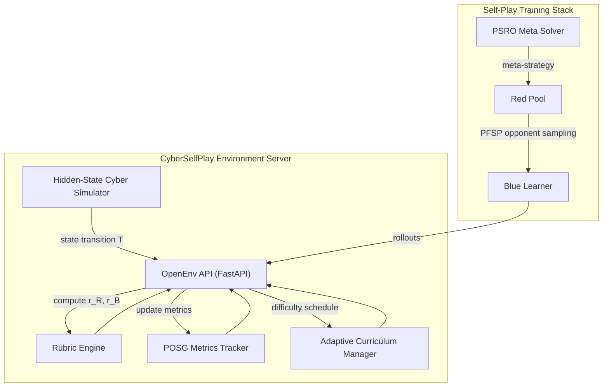
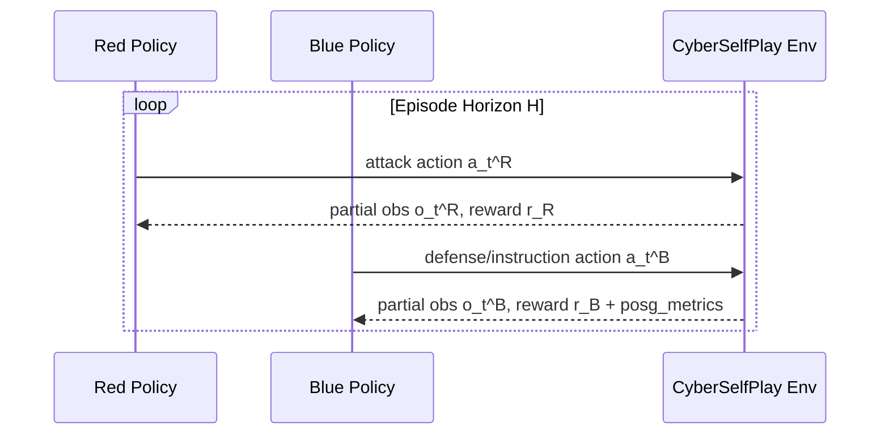

# CyberSelfPlay: Autonomous Red-vs-Blue Cyber Defense Environment

**CyberSelfPlay** is an OpenEnv-compliant reinforcement learning world designed for **long-horizon planning + instruction following** and **self-improvement via league self-play**.  
The environment models enterprise compromise dynamics under partial observability, where a Blue policy must execute long recovery plans (up to 300 instructions), while adapting against evolving Red policies.

---

## Core Reasoning Technologies

### 1) Two-Player POSG Cyber Model
The environment is formalized as a two-player partially observable stochastic game:

$$
\mathcal{G}=\langle \mathcal{S},\mathcal{A}_R,\mathcal{A}_B,\mathcal{O}_R,\mathcal{O}_B,T,Z_R,Z_B,r_R,r_B,\gamma \rangle
$$

with objectives:

$$
J_i(\pi_i,\pi_{-i})=\mathbb{E}\left[\sum_{t=0}^{H}\gamma^t r_i(s_t,a_t^R,a_t^B)\right], \quad i\in\{R,B\}
$$

Near-zero-sum with collateral disruption:

$$
r_B=-r_R-\lambda C_{\text{collateral}}
$$

### 2) Long-Horizon Instruction Execution
Blue must satisfy a mission list $\mathcal{I}=\{I_1,\dots,I_N\}$ with $N\in\{40,120,300\}$ depending on scenario scale.  
Completion rate is:

$$
\rho_{\text{inst}}=\frac{|\mathcal{I}_{\text{done}}|}{|\mathcal{I}|}
$$

Violation rate is:

$$
\nu_{\text{inst}}=\frac{|\mathcal{I}_{\text{violated}}|}{|\mathcal{I}|}
$$

These values are surfaced in `posg_metrics` each step.

### 3) Dense + Delayed Reward Law
Red reward:

$$
r_R = w_1 I_{\text{foothold}} + w_2 I_{\text{priv}} + w_3 I_{\text{lateral}} + w_4 I_{\text{exfil}}
- w_5 I_{\text{detect}} + w_6 I_{\text{plan\_sabotage}} - \eta_R
$$

Blue reward:

$$
r_B = v_1 I_{\text{detect}} + v_2 I_{\text{contain}} + v_3 I_{\text{recover}} - v_4 I_{\text{exfil}}
+ v_5 I_{\text{instruction\_progress}} + v_6 I_{\text{checkpoint}} - v_7 I_{\text{instruction\_violation}}
+ v_8 \rho_{\text{inst}} - \eta_B
$$

This combines immediate cyber events with delayed plan-following signal.

### 4) Adaptive Self-Improvement via League
Opponents are sampled with PFSP:

$$
p_j \propto f(w_j), \qquad f(w)=w(1-w)
$$

This prioritizes informative matchups near $w_j=0.5$.  
A PSRO-style restricted-game helper updates meta-strategies with a replicator step:

$$
p_i' \propto p_i \left(1+\eta(u_i-\bar{u})\right)
$$

where $\bar{u}=\sum_i p_i u_i$.

---

## System Architecture



---

## Long-Horizon Dynamics

Episodes are intentionally long to test durable internal state tracking:

- `small`: 60 turns, ~40 instructions
- `medium`: 100 turns, ~120 instructions
- `large`: 180 turns, ~300 instructions

Blue receives delayed checkpoint rewards every `checkpoint_every` steps and can lose by timeout if instruction completion is too low.

---

## Built-in Evaluation Metrics

The environment emits metrics suitable for hackathon judging and ablations:

- **MTTD**:
  $$
  \text{MTTD}=t_{\text{first-detect}}-t_{\text{first-compromise}}
  $$
- **MTTR**:
  $$
  \text{MTTR}=t_{\text{recover}}-t_{\text{first-detect}}
  $$
- **Exfiltration Success Rate**
- **Critical Asset Compromise Rate**
- **False-Positive Disruption Cost**
- **Instruction Completion / Violation Rates**

---

## Project Structure

- `cyber_selfplay_env/environment.py` - OpenEnv env class
- `cyber_selfplay_env/simulator.py` - stochastic hidden dynamics + instruction missions
- `cyber_selfplay_env/rubrics.py` - reward composition functions
- `cyber_selfplay_env/metrics.py` - MTTD/MTTR and mission metrics
- `cyber_selfplay_env/curriculum.py` - automatic scenario escalation
- `cyber_selfplay_env/tools_red.py`, `cyber_selfplay_env/tools_blue.py` - action spaces
- `server/app.py` - FastAPI OpenEnv app
- `client.py` - Env client in the same style as AutoMathReasoner
- `train/pfsp.py` - PFSP sampler
- `train/psro_meta.py` - restricted-game meta-strategy helper
- `train/train_blue_vs_pool.py`, `train/train_red_vs_pool.py` - league loops
- `train/evaluate_league.py` - metrics + exploitability-gap proxy
- `train/colab_trl_selfplay.py` - Colab-ready TRL script
- `notebooks/colab_trl_selfplay.ipynb` - Colab notebook

---

## Interaction Loop



---

## Running the Environment

### 1) Local server
```bash
pip install -e .[train]
python -m server.app
```

### 2) Client endpoint
```text
http://localhost:7870
```

### 3) Colab minimal training
```bash
python train/colab_trl_selfplay.py
```
or run `notebooks/colab_trl_selfplay.ipynb`.

---

## Submission Checklist

- [ ] Hugging Face Space URL: `<add-space-link>`
- [ ] Demo video/blog/slides (< 2 minutes): `<add-link>`
- [ ] Reward and metric plots committed (`.png`/`.jpg`)
- [ ] Before-vs-after episode traces in README

---

## References

- [Vinyals et al., Nature 2019 (AlphaStar)](https://www.nature.com/articles/s41586-019-1724-z)
- [Lanctot et al., NeurIPS 2017 (PSRO)](https://mlanctot.info/files/papers/nips17-psro.pdf)
- [Hu et al., ACM TOPS 2021 (Cyber Defense POMDP)](https://doi.org/10.1145/3418897)
- [CAGE-2 POMDP Defender Formulation](https://arxiv.org/html/2509.06539v1)
